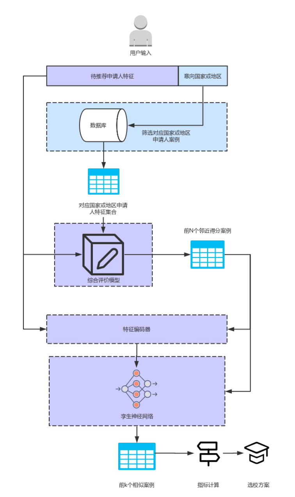
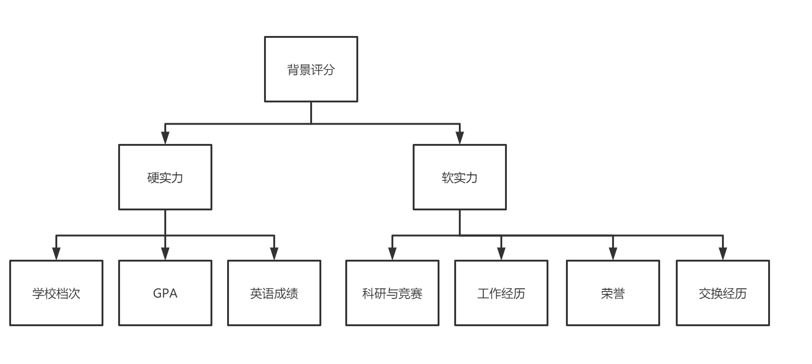

# 申公公推荐系统选校方案设计

> **作者**：丁卓非
>
> **邮箱**：872573678@qq.com
>
> **版本**：v2.1

## 一、算法方案

> **v2.2版本变更说明**
>
> * 完成了工程方案设计

### 1. 整体思想

> 旨在设计一种精确、效率高、兼并丰富度与准确度的留学选校推荐方案

* 逐次筛选，逐步细化
* 引入权重，评估特征

### 2. 数据说明

* **学校列表**

| 数据项名称 | 字段名  | 类型   |
| ---------- | ------- | ------ |
| 编号       | code    | int    |
| 中文名     | cn_name | string |
| 英文名     | en_name | string |
| 国家       | country | string |

* **申请人列表**

| 数据项名称 | 字段名  | 类型   |
| ---------- | ------- | ------ |
| 申请人编号 | aid     | string |
| 学校档次   | bschool | string |
| 本科专业   | major   | string |
| 本科成绩   | gpa     | float  |
| 雅思成绩   | ielts   | float  |
| 托福成绩   | toefl   | float  |
| GRE        | gre     | float  |
| GMAT       | gmat    | float  |
| 个人说明   | marker  | string |

* **录取结果列表**

| 数据项名称   | 字段名      | 类型   |
| ------------ | ----------- | ------ |
| 申请人编号   | aid         | string |
| 录取专业     | major       | string |
| 录取结果     | result      | string |
| 录取学校     | tschool     | string |
| 录取学校编号 | school_code | int    |

### 3. 推荐方案路线图

* 按待推荐申请人意向国家或地区查找所有的案例库申请者；
* 对待推荐申请人特征进行评估，计算用户申请背景得分，查找案例库中与该用户得分邻近的前N个申请人；
* 对待推荐申请人特征进行编码，**具体方案见《设计方案V1.0》**；
* 使用孪生神经网络，寻找N个申请人中与该用户最相似的前k个申请人；
* 统计前k个申请人中，各个录取学校的占比，使用该占比修正相似度平均指标，选取相似度最高的前m个学校推荐。



### 4. 各层次筛选详解

#### 4.1 初次筛选（范围界定）

* 直接通过查询案例数据库，筛选得到目标地区的全部案例。
* 初次筛选是范围的界定，以业务为导向，可以**兼容混合地区选校**，如港英混申、英美混申。
* 为满足初次筛选需求，需要建立**学校-地区**对应表格。

#### 4.2 二次筛选（背景评分）

* 使用综合评价模型**对待推荐申请人背景进行评分**，案例库中该评分作为一个字段存储。



* 综合评价模型主要以**加权赋值**为主，按照不同国家或地区录取新生时的偏好进行赋权（需要问卷调研）。
* 选取一定区间内与申请人评分相近的k个案例，作为二次筛选的结果。

#### 4.3 三次筛选（相似度评价）

* 使用孪生神经网络，将待推荐申请人编码后的特征与二次筛选的结果经编码后的特征输入孪生神经网络，网络计算两个申请人之间的背景相似程度。

  * 神经网络的训练数据集正例构建遵顼以下原则：
    * 两申请人被同一个学校录取；
  * 神经网络的训练数据集负例构建遵循以下几个原则：
    * 两申请人被录取的学校不同；
    * 两申请人所在的本科学校不属同一个档次；
    * 两申请人的GPA分差超过三分。
  * 训练集正例标注为1，负例标注为0，使用曼哈顿相似度作为相似程度的度量。
  
  

* 对案例相似度进行排序，选择前k个相似的申请人案例作为三次筛选的输出。

* 具体网络结构如下表所示：

  | Layer  | Structure                                | Connected to |
  | ------ | ---------------------------------------- | ------------ |
  | 输入层 | 输入层（shape=(109, None)）              | -            |
  | 共享层 | 全连接层（units=100, activation="tanh"） | -            |
  |        | 全连接层（units=100, activation="tanh"） | -            |
  |        | 全连接层（units=128, activation="tanh"） | 输入层       |
  | 输出层 | 曼哈顿相似度                             | 共享层       |

* 实验结果入下图所示：

  

#### 4.4 四次筛选（指标计算）

* 记三次筛选的输出数据集为：
  $$
  O_3 = \{a_1,a_2,...,a_k\}
  $$
  其中，每个申请人案例对应多个录取的学校，第i个申请人被录取的学校记为：
  $$
  school_i = \{s_1,s_2,...,s_l\}
  $$
  统计O3中所有申请人被录取的学校中，各个学校出现的次数占数据集中所有学校出现次数之和的比例，结果如下表所示：

  | 学校 | 比例 |
  | ---- | ---- |
  | s1   | c1   |
  | s2   | c2   |
  | ...  | ...  |
  | sj   | cj   |
  | ...  | ...  |

  计算O3中所有学校对应的申请人案例与待推荐申请人相似度平均数，结果如下表

  | 学校 | 相似度平均 |
  | ---- | ---------- |
  | s1   | v1         |
  | s2   | v2         |
  | ...  | ...        |
  | sj   | vj         |
  | ...  | ...        |

* 定义待推荐人被si校录取的可能性指标:
  $$
  indicator_i=\frac{c_jv_j}{1+r_j}
  $$

* 选择indicator值最大的前m个学校，推荐给待推荐申请人。


## 二、技术实现方案

### 1. 技术选型

* **编程语言**：混编，主应用JAVA，推荐服务Python。
* **通信方式**：推荐服务与主应用采用RPC通信，采用GRPC库（基于http2）、Protobuf。
* **数据库**：MySQL云数据库

### 2. 实现方案

#### 2.1 数据库设计

* **学校表** school_t

| 数据项名称   | 字段名  | 类型   |
| ------------ | ------- | ------ |
| 编号(PK)     | code    | int    |
| 中文名       | cn_name | string |
| 英文名       | en_name | string |
| 国家(加索引) | country | string |

* **申请人信息表** application_t

| 数据项名称       | 字段名       | 类型   |
| ---------------- | ------------ | ------ |
| 申请人编号(PK)   | aid          | string |
| 学校档次         | bschool      | string |
| 本科专业         | major        | string |
| 本科成绩         | gpa          | float  |
| 雅思成绩         | ielts        | float  |
| 托福成绩         | toefl        | float  |
| GRE              | gre          | float  |
| GMAT             | gmat         | float  |
| 个人说明         | marker       | string |
| 专业特征向量     | major_vector | string |
| 背景评分(加索引) | score        | float  |

* **录取结果表** offer_t

| 数据项名称   | 字段名      | 类型   |
| ------------ | ----------- | ------ |
| 录取编号(PK) | offer_id    | int    |
| 申请人编号   | aid         | string |
| 录取专业     | major       | string |
| 录取结果     | result      | string |
| 录取学校     | tschool     | string |
| 录取学校编号 | school_code | int    |

#### 2.2 整体方案

* **五层结构**：
  * 数据库层：提供数据支撑；
  * 特征处理层：对输入数据进行特征处理，包括计算综合评分；
  * 数据筛选层：进行数据库的查询操作，逐次筛选邻近样本；
  * 神经网络层：使用孪生神经网络进行相似评分，该层包含了指标计算；
  * 对外接口层：与主程序交互，暴露RPC接口。


* **业务逻辑**：

  * 主应用调用RPC，按规范调用接口函数；
  * 推荐服务解析参数；
  * 推荐服务对传入参数进行特征处理；
  * 推荐服务根据国家或地区，查询数据表，获得初次筛选结果；
  * 推荐服务根据综合评价得分，查询数据表，获得二次筛选结果；
  * 推荐服务使用孪生神经网络衡量特征向量与二次筛选结果的相似度；
  * 推荐服务计算概率指标，确定推荐内容；
  * 推荐服务将结果通过连接传至主应用；
  * 主应用获取结果进行下一步操作。

  

### 3. 接口设计

#### 3.1 RPC设计

* **请求地址**

  ```http://111.230.142.105:5000```

* **请求参数**

| 属性名           | 必选 | 类型   | 说明                               |
| :--------------- | :--- | :----- | ---------------------------------- |
| ug_level         | 是   | String | 用户的本科院校所属层次             |
| ug_major         | 是   | String | 用户本科专业                       |
| intended_country | 是   | String | 用户意向申请国家或地区             |
| ug_gpa           | 是   | float  | 用户本科GPA                        |
| gre              | 否   | float  | 用户GRE成绩                        |
| gmat             | 否   | float  | 用户GMAT成绩                       |
| toefl            | 否   | float  | 用户托福成绩                       |
| ielts            | 否   | float  | 用户雅思成绩                       |
| marker           | 否   | String | 用户的项目/论文/获奖/实习/工作经理 |

* **返回示例**

```protobuf
code: 0
msg: "ok"
data {
  key: "卡迪夫大学"
  value {
    partly_ratio: 0.6000000238418579
    total_ratio: 0.10000000149011612
  }
}
data {
  key: "纽卡斯尔大学"
  value {
    partly_ratio: 0.6000000238418579
    total_ratio: 0.10000000149011612
  }
}
data {
  key: "伯明翰大学"
  value {
    partly_ratio: 0.6000000238418579
    total_ratio: 0.10000000149011612
  }
}
data {
  key: "格拉斯哥大学"
  value {
    partly_ratio: 0.6000000238418579
    total_ratio: 0.10000000149011612
  }
}
data {
  key: "卡迪夫大学"
  value {
    partly_ratio: 0.6000000238418579
    total_ratio: 0.10000000149011612
  }
}
data {
  key: "纽卡斯尔大学"
  value {
    partly_ratio: 0.6000000238418579
    total_ratio: 0.10000000149011612
  }
}
data {
  key: "伯明翰大学"
  value {
    partly_ratio: 0.6000000238418579
    total_ratio: 0.10000000149011612
  }
}
data {
  key: "格拉斯哥大学"
  value {
    partly_ratio: 0.6000000238418579
    total_ratio: 0.10000000149011612
  }
}
```

* **编码含义**

0 -> ok


#### 3.2 主应用接口设计

见：```https://www.showdoc.com.cn/HoiLui?page_id=4458517071001505```